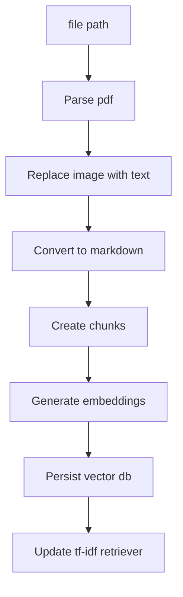
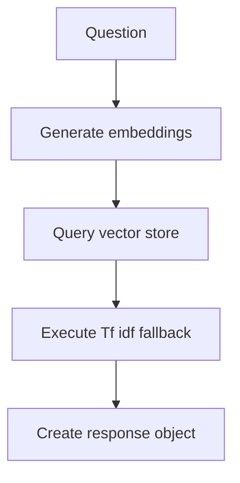

# Mini local RAG

---

## Table of Contents

- [How to run](#how-to-run)
  - [Dependencies](#dependencies)
- [Examples](#examples)
- [Tests](#Tests)
- [Pipelines](#Pipelines)
  - [Ingestion flow](#ingestion-flow)
  - [Question flow](#question-flow)
- [Requirements](#requirements)

## How to Run

### Dependencies

To run the tests, you must have a running localhost ollama instance with these models pulled

- gemma3:4b
- llama3.2:1b
- qwen3-embedding:4b

### Using hatch

```console
pip install hatch
```

or

```console
python -m venv venv
./venv/scripts/activate
pip install hatch
```

##### Ask question

```console
hatch run main ask "[question]"
```

##### Ingest pdf

```console
hatch run main ingest "[full_path]"
```

##### Help

```console
hatch run main -h
```

## Examples

```console
PS C:\mini-local-rag> hatch run main ask "what is FDS guidance on controll group in clinical trials?"
Planning answer Status: Draft response ━━━━━━━━━━━━━━━━━━━━━━━━━━━━━━━━━━━━━━━━ 100%
                                                                                           Response

FDS Guidance on Control Group in Clinical Trials

Overview of Control Groups

The FDA provides guidelines on choosing a control group for clinical trials intended to demonstrate the efficacy of a treatment.

Types of Control Groups

Active Control Trial

An active control trial is one where an actual treatment or intervention is used as the comparison group. This type of trial helps to establish that the new treatment is effective compared
to existing standard therapies.

Non-Active Control Trials

Non-active control trials use alternative control groups such as standard therapies, placebo controls, or other treatments without an active component.

Ethical Considerations

 • The choice of control group should be considered in the context of available standard therapies.
 • Adequate evidence is necessary to support the chosen design and interpretation.
 • Ethical considerations must be taken into account when selecting a control group.

Example Tables


                       Control Group Characteristics        Bias Minimization         Inferential Quality
 ────────────────────────────────────────────────────────────────────────────────────────────────────────────────────────────────────────
 Active Control Trial  Actual treatment used as comparison  No, due to active nature  Yes, based on established efficacy of new treatment


Advantages and Disadvantages

The guidance outlines several advantages and disadvantages of using different types of control groups in clinical trials. These include:

 • Advantages:
    • Allows for establishment of efficacy
    • Can provide evidence of new treatment's benefits
    • Provides insight into treatment's overall effectiveness
 • Disadvantages:
    • Requires adequate evidence to support chosen design and interpretation
    • May raise ethical concerns when using alternative control groups


 Document                                                                       Section
 ────────────────────────────────────────────────────────────────────────────────────────────────────────────────────────────────────────────────
 C:\Users\User\Documents\E10 - Document 3.pdf  A. General Scheme and Purpose of Guidance (1.1)
 C:\Users\User\Documents\E10 - Document 3.pdf  E10 Choice of Control Group and Related Issues in Clinical Trials
 C:\Users\User\Documents\E10 - Document 3.pdf  A. General Scheme and Purpose of Guidance (1.1)


--------------------------------------------------------------------------------------------------------------
```

```console
PS C:\mini-local-rag> hatch run main ask "what is a clinical investigation?"
Planning answer Status: Draft response ━━━━━━━━━━━━━━━━━━━━━━━━━━━━━━━━━━━━━━━━ 100%
                                                                                           Response

Clinical Investigation

Definition

 • A clinical investigation is any process used in human subject research that involves the use of human subjects to test or evaluate the effects and efficacy of medications, medical
   devices, treatments, or other products.

Characteristics

Clinical investigations can be broadly categorized into two types:

 1 Placebo-controlled trials: These are studies where a treatment group receives a placebo (a dummy treatment) alongside a real treatment.
 2 Controlled trials: These are studies without a placebo, where the only difference between groups is the intervention or treatment being tested.

Purpose

The primary purpose of clinical investigations is to ensure that treatments or products are safe and effective by comparing them against a control group.

Examples

 1 Clinical trials for new medications
 2 Evaluating the effectiveness of medical devices
 3 Assessing the safety and efficacy of surgical procedures


 Document                                                                       Section
 ──────────────────────────────────────────────────────────────────────────────────────────────────────────────────────────────
 C:\Users\User\Documents\E10 - Document 3.pdf  A. General Scheme and Purpose of Guidance (1.1)
 C:\Users\User\Documents\E10 - Document 3.pdf  1. Description (2.5.1)
 C:\Users\User\Documents\E10 - Document 3.pdf  b. Appropriate Trial Conduct (1.5.1.2)


----------------------------------------------------------------------------------------------------------------------------------------------------------------------------------------------

```

## Tests

##### unit tests

```console
hatch test --python 3.12
```

##### coverage

```console
hatch test --python 3.12 --cover
```

## Pipelines

#### Ingestion flow



#### Question flow



## Requirements

**Build a local mini RAG/Agentic Q&A over a small provided corpus (3 provided PDF files).**
**Use Ollama with an offline embedding model**

#### logs

logs must have a format like:

```json
{
  "trace_id": "uuid",
  "question": "...",
  "plan": ["Parsing Pdf file", "Replacing images", "...", "..."],
  "retrieval": [
    {
      "file": "a.txt",
      "chunk_id": 42,
      "score": 0.75
    }
  ],
  "latency": {
    "Parsing Pdf file": 39.73,
    "Replacing images": 233.68,
    "...": 0.1,
    "...": 0.0
  },
  "errors": []
}
```

and have 1 log per request
