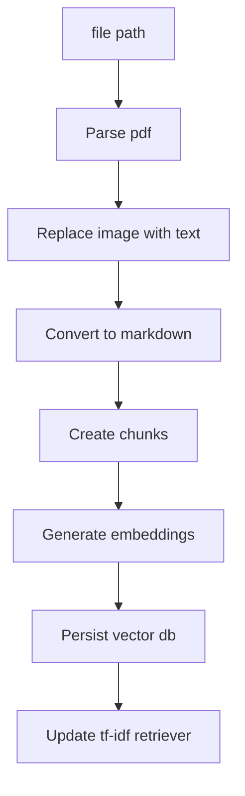
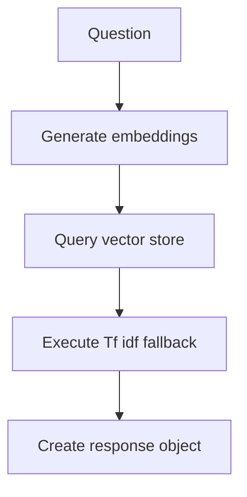

# Mini local RAG

---

## Table of Contents

- [How to run](#how-to-run)
  - [Dependencies](#dependencies)
  - [hatch](#Using-hatch)
  - [Docker](#docker)
- [Examples](#examples)
- [Tests](#Tests)
- [Pipelines](#Pipelines)
  - [Ingestion flow](#ingestion-flow)
  - [Question flow](#question-flow)
- [Requirements](#requirements)

## How to Run

### Dependencies

To run the tests, you must have a running localhost ollama instance with these models pulled

- gemma3:4b
- llama3.2:1b
- qwen3-embedding:4b

### Using hatch

```console
pip install hatch
```

or

```console
python -m venv venv
./venv/scripts/activate
pip install hatch
```

##### Interactive

```console
hatch run main -i / hatch run main --interactive
```

##### Ask question

```console
hatch run main ask "[question]"
```

##### Ingest pdf

```console
hatch run main ingest "[full_path]"
```

##### Help

```console
hatch run main -h
```

### Docker

Start ollama

```console
docker compose up ollama_with_images
```

or detached mode

```console
docker compose up -d ollama_with_images
```

Wait to finish and then Run cli

```console
docker compose run it mini-local-rag
```

it will direclty open the cli in interactive mode

you still need to manually ingest the documents:

```console
ingest "/app/documents/E3 Structure - Document 2.pdf"
ingest "/app/documents/E10 - Document 3.pdf"
ingest "/app/documents/ICD - Document 1.pdf"
```

## Examples

```console
PS C:\mini-local-rag> hatch run main ask "what is FDS guidance on controll group in clinical trials?"
Planning answer Status: Draft response ━━━━━━━━━━━━━━━━━━━━━━━━━━━━━━━━━━━━━━━━ 100%
                                                                                           Response

FDS Guidance on Control Group in Clinical Trials

Overview of Control Groups

The FDA provides guidelines on choosing a control group for clinical trials intended to demonstrate the efficacy of a treatment.

Types of Control Groups

Active Control Trial

An active control trial is one where an actual treatment or intervention is used as the comparison group. This type of trial helps to establish that the new treatment is effective compared
to existing standard therapies.

Non-Active Control Trials

Non-active control trials use alternative control groups such as standard therapies, placebo controls, or other treatments without an active component.

Ethical Considerations

 • The choice of control group should be considered in the context of available standard therapies.
 • Adequate evidence is necessary to support the chosen design and interpretation.
 • Ethical considerations must be taken into account when selecting a control group.

Example Tables


                       Control Group Characteristics        Bias Minimization         Inferential Quality
 ────────────────────────────────────────────────────────────────────────────────────────────────────────────────────────────────────────
 Active Control Trial  Actual treatment used as comparison  No, due to active nature  Yes, based on established efficacy of new treatment


Advantages and Disadvantages

The guidance outlines several advantages and disadvantages of using different types of control groups in clinical trials. These include:

 • Advantages:
    • Allows for establishment of efficacy
    • Can provide evidence of new treatment's benefits
    • Provides insight into treatment's overall effectiveness
 • Disadvantages:
    • Requires adequate evidence to support chosen design and interpretation
    • May raise ethical concerns when using alternative control groups


 Document                                                                       Section
 ────────────────────────────────────────────────────────────────────────────────────────────────────────────────────────────────────────────────
 C:\Users\User\Documents\E10 - Document 3.pdf  A. General Scheme and Purpose of Guidance (1.1)
 C:\Users\User\Documents\E10 - Document 3.pdf  E10 Choice of Control Group and Related Issues in Clinical Trials
 C:\Users\User\Documents\E10 - Document 3.pdf  A. General Scheme and Purpose of Guidance (1.1)


--------------------------------------------------------------------------------------------------------------
```

```console
PS C:\mini-local-rag> hatch run main ask "what is a clinical investigation?"
Planning answer Status: Draft response ━━━━━━━━━━━━━━━━━━━━━━━━━━━━━━━━━━━━━━━━ 100%
                                                                                           Response

Clinical Investigation

Definition

 • A clinical investigation is any process used in human subject research that involves the use of human subjects to test or evaluate the effects and efficacy of medications, medical
   devices, treatments, or other products.

Characteristics

Clinical investigations can be broadly categorized into two types:

 1 Placebo-controlled trials: These are studies where a treatment group receives a placebo (a dummy treatment) alongside a real treatment.
 2 Controlled trials: These are studies without a placebo, where the only difference between groups is the intervention or treatment being tested.

Purpose

The primary purpose of clinical investigations is to ensure that treatments or products are safe and effective by comparing them against a control group.

Examples

 1 Clinical trials for new medications
 2 Evaluating the effectiveness of medical devices
 3 Assessing the safety and efficacy of surgical procedures


 Document                                                                       Section
 ──────────────────────────────────────────────────────────────────────────────────────────────────────────────────────────────
 C:\Users\User\Documents\E10 - Document 3.pdf  A. General Scheme and Purpose of Guidance (1.1)
 C:\Users\User\Documents\E10 - Document 3.pdf  1. Description (2.5.1)
 C:\Users\User\Documents\E10 - Document 3.pdf  b. Appropriate Trial Conduct (1.5.1.2)


----------------------------------------------------------------------------------------------------------------------------------------------------------------------------------------------

```

```console
PS C:\mini-local-rag> hatch run main "Should documents available in the TMF be included in the CSR appendices?"
Planning answer Status: Draft response ━━━━━━━━━━━━━━━━━━━━━━━━━━━━━━━━━━━━━━━━ 100%
                                                                                                                                  Response

Include Documents Available in the TMF in CSR Appendices?

According to the context provided by RAG, no, documents available in the Trial Master File (TMF) should not be included in the CSR appendices.

To confirm this, let's look at section 3.5 of the guidance. It states:

"Documents that provide critical information on a study, such as the protocol (16.1.1), statistical methods (16.1.9), list of investigators and study sites, and sample case report forms, would always be needed by reviewers assessing a study and should be included in
the trial report even if they are in a TMF."

Therefore, documents available in the TMF should not be included in the CSR appendices.

Additionally, section 3.6 provides further clarification:

"The documentation necessary to review the CSR should be included in the CSR appendices. It is not sufficient for such documents to be included only in the TMF, which is not submitted in the marketing application."

This reinforces that documents available in the TMF are already part of the trial report and should not need to be separately appended to the CSR.


 Document                                                                                Section
 ───────────────────────────────────────────────────────────────────────────────────────────────────────────────────────────
 C:\Users\User\Documents\E3 Structure - Document 2.pdf  B. Appendices (2)
 C:\Users\User\Documents\E3 Structure - Document 2.pdf  Contains Nonbinding Recommendations
 C:\Users\User\Documents\E3 Structure - Document 2.pdf  Contains Nonbinding Recommendations


-----------------------------------------------------------------------------------------------------------------------------------------------------------------------------------------------------------------------------------------------------------------------------

```

#### Example using data from image

Last page of the file _E10 Document 3.pdf_ is a figure and parsed as image.

```console
PS C:\mini-local-rag> hatch run main ask "how can i add someone on a control group when the proven effective treatment is life saving?"
Planning answer Status: Draft response ━━━━━━━━━━━━━━━━━━━━━━━━━━━━━━━━━━━━━━━━ 100%
                                                                                                                                  Response

Based on the reports provided context and information about adding someone to a control group, it appears that there are two approaches that could work:

 1 External Control Group: In this approach, you would select a well-documented population of patients as the control group that has not received the proven effective treatment. This ensures that any observed differences in outcomes between the treated and untreated
   groups can be attributed to the intervention rather than the underlying condition.
 2 Historical Control: Another option is to use an historical control, which refers to a group of patients who have been observed at an earlier time (e.g., before the treatment was introduced) but have not received the proven effective treatment.

Both approaches offer advantages:

 • External Control Group: Reduces the risk of bias and ensures that any differences in outcomes between groups are due to the intervention.
 • Historical Control: Provides a more robust estimate of the effect size, as it is based on data from an earlier time point.

Here's an example markdown string that can be used to answer this question:

"In general, selecting an external control group with patients who have not received the proven effective treatment would be a suitable approach. This ensures that any observed differences in outcomes between groups are due to the intervention rather than the
underlying condition."

Or, using the historical control option:

"The use of an historical control could also be considered, where the control group consists of patients who have been observed at an earlier time point (e.g., before the treatment was introduced)."


 Document                                                                       Section
 ───────────────────────────────────────────────────────────────────────────────────────────────────────────────────────────────────────────────────
 C:\Users\User\Documents\E10 - Document 3.pdf  Figure 1: Choosing the Concurrent Control for Demonstrating Efficacy
 C:\Users\User\Documents\E10 - Document 3.pdf  b. Other Modifications of Study Design (2.1.5.2)
 C:\Users\User\Documents\E10 - Document 3.pdf  1. Description (2.5.1)


-----------------------------------------------------------------------------------------------------------------------------------------------------------------------------------------------------------------------------------------------------------------------------

```

## Tests

##### unit tests

```console
hatch test --python 3.12
```

##### coverage

```console
hatch test --python 3.12 --cover
```

## Pipelines

#### Ingestion flow



#### Question flow



## Requirements

**Build a local mini RAG/Agentic Q&A over a small provided corpus (3 provided PDF files).**
**Use Ollama with an offline embedding model**

#### logs

logs must have a format like:

```json
{
  "trace_id": "uuid",
  "question": "...",
  "plan": ["Parsing Pdf file", "Replacing images", "...", "..."],
  "retrieval": [
    {
      "file": "a.txt",
      "chunk_id": 42,
      "score": 0.75
    }
  ],
  "latency": {
    "Parsing Pdf file": 39.73,
    "Replacing images": 233.68,
    "...": 0.1,
    "...": 0.0
  },
  "errors": []
}
```

and have 1 log per request
