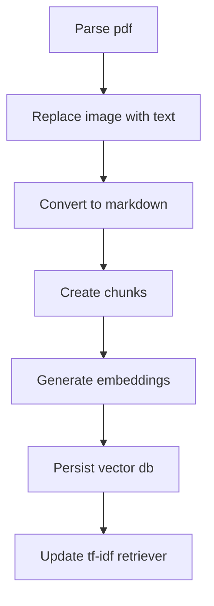

# Mini local RAG

---

## Table of Contents

- [How to run](#how-to-run)
  - [Dependencies](#dependencies)
- [Tests](#Tests)
- [Pipelines](#Pipelines)
  - [Ingestion flow](#ingestion-flow)
  - [Question flow](#question-flow)
- [Requirements](#requirements)

## How to Run

### Dependencies

To run the tests, you must have a running localhost ollama instance with these models pulled

- gemma3:4b

### Using hatch

```console
pip install hatch
```

or

```console
python -m venv venv
./venv/scripts/activate
pip install hatch
```

##### Ask question

```console
hatch run main ask "[question]"
```

##### Ingest pdf

```console
hatch run main ingest "[full_path]"
```

##### Help

```console
hatch run main -h
```

## Tests

##### unit tests

```console
hatch test --python 3.12
```

##### coverage

```console
hatch test --python 3.12 --cover
```

## Pipelines

#### Ingestion flow



#### Question flow

## Requirements

**Build a local mini RAG/Agentic Q&A over a small provided corpus (3 provided PDF files).**
**Use Ollama with an offline embedding model**

#### logs

logs must have a format like:

```json
{
  "trace_id": "uuid",
  "question": "...",
  "plan": ["Parsing Pdf file", "Replacing images", "...", "..."],
  "retrieval": [
    {
      "file": "a.txt",
      "chunk_id": 42,
      "score": 0.75
    }
  ],
  "latency": {
    "Parsing Pdf file": 39.73,
    "Replacing images": 233.68,
    "...": 0.1,
    "...": 0.0
  },
  "errors": []
}
```

and have 1 log per request
